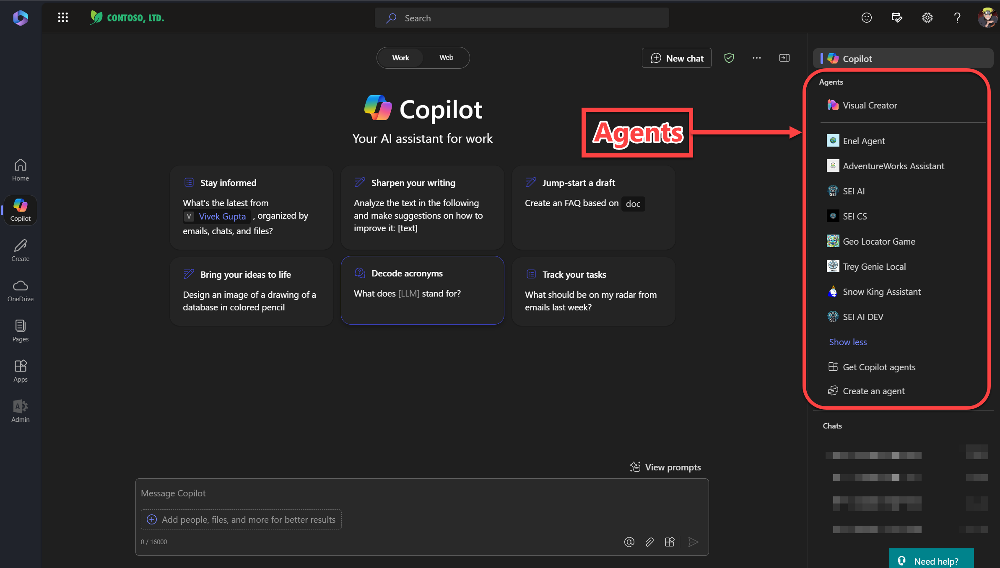
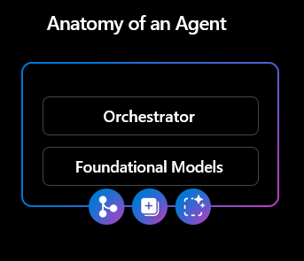
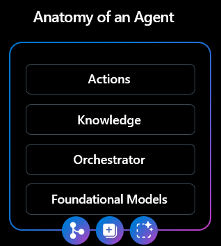

# Learn how to build a Declarative Agent via Copilot Studio to consume ServiceNow Graph Connectors and REST APIs

In this hands-on lab, you will dive into the world of automation and integration by using Copilot Studio to create a Declarative Agent tailored for ServiceNow interactions. Here's what you'll learn:

* **Building a Declarative Agent in Copilot Studio:** Understand the fundamentals of setting up and configuring a Declarative Agent specifically designed to interact seamlessly with ServiceNow.

* **Leveraging ServiceNow Graph Connectors:** You'll explore how to integrate your agent with ServiceNow's KnowledgeBase and Catalog connectors. This will enable your agent to fetch and manage knowledge articles and service catalog items directly from ServiceNow, enhancing its capability to provide precise, context-aware responses or actions.

* **Consuming ServiceNow REST APIs with Actions:** Gain hands-on experience in using Actions within Copilot Studio to interact with ServiceNow's REST APIs. This includes learning how to make authenticated API calls to retrieve, update, or create data in ServiceNow, thus extending the functionality of your Declarative Agent.

* **Setting Up Email Communication:** Learn how to configure your agent to send emails. This skill will allow your agent to notify users or administrators based on certain triggers or workflow outcomes within ServiceNow, ensuring smooth communication and workflow management.

By the end of this lab, you'll have a functional Declarative Agent that can interact with ServiceNow to manage knowledge, service requests, and automate notifications, thereby enhancing productivity and user experience in your organization's ServiceNow environment.

Here's a refined agenda for your hands-on lab, ensuring a logical progression through the learning process:

## Agenda:

1. **Introduction to Declarative Agents in Copilot Studio**
 * Overview of Declarative Agents
 * Creating a new Declarative Agent in Copilot Studio

2. **Configuring ServiceNow Graph Connectors**
* Understanding ServiceNow's Knowledge Base and Service Catalog connectors
* Authentication and setup in ServiceNow for the connectors
* Integrating Graph Connectors with your agent in Copilot Studio

3. **Consuming ServiceNow Graph Connectors**
* Querying and retrieving data from Knowledge Base
* Managing items from the Service Catalog through your agent
* Practical exercises to interact with these connectors

4. **Introduction to ServiceNow REST APIs**
* Basics of REST APIs in ServiceNow
* Authorization and security considerations
* Setting up actions in Copilot Studio for API interaction

5. **Implementing ServiceNow REST API Consumption**
* Creating Actions to fetch, update, or insert data via REST API
* Real-time examples of data manipulation using your agent
* Troubleshooting common API issues

6. **Email Integration with Copilot Studio**
* Configuring email services within Copilot Studio
* Setting up triggers for email notifications based on ServiceNow actions or events
* Testing and validation of email functionality

7. Wrap-up
* Review of key concepts covered
* Next steps and further learning resources

## Introduction to Declarative Agents in Copilot Studio
 
### Overview of Declarative Agents

[Copilot Declarative Agents](https://learn.microsoft.com/en-us/microsoft-365-copilot/extensibility/overview-declarative-agent) are a feature of Microsoft 365 Copilot that allow users to create customized agents tailored to specific business needs. These agents are built using the Copilot foundation, which means developers do not need to create anything from scratch. Instead, they can leverage the existing infrastructure, foundation models, and trusted AI services that power Microsoft 365 Copilot. Declarative agents can be designed to perform a variety of tasks, such as automating repetitive processes, providing real-time customer support, or enhancing internal workflows by integrating with enterprise data from sources like SharePoint and Microsoft Graph.

One of the key benefits of declarative agents is their ability to provide consistent and personalized experiences for users. They can be easily created using tools like Copilot Studio, which offers a user-friendly interface for building and configuring agents. Once deployed, these agents can be integrated into various Microsoft 365 applications, such as Teams, SharePoint, and BizChat, allowing users to interact with them seamlessly. By optimizing collaboration and increasing productivity, declarative agents help organizations streamline their operations and improve overall efficiency.

When we create a declarative agent, we indeed lose access to the semantic index and only have access to the large language model (LLM). This is because declarative agents are designed to be specialists, focusing on specific tasks or domains. To achieve this specialization, we define a persona and provide detailed instructions for the agent, ensuring it can perform its designated functions effectively and consistently.

However, we can still enhance the agent's knowledge by integrating parts of the semantic index through graph connectors and SharePoint. This allows the agent to access relevant enterprise data and improve its responses. Additionally, we can provide real-time information to the agent via actions or even through Internet web searches. This ensures the agent stays updated and relevant, delivering accurate and timely responses based on the most current data available. By combining these methods, we can create a highly specialized and knowledgeable agent that meets specific business needs.

